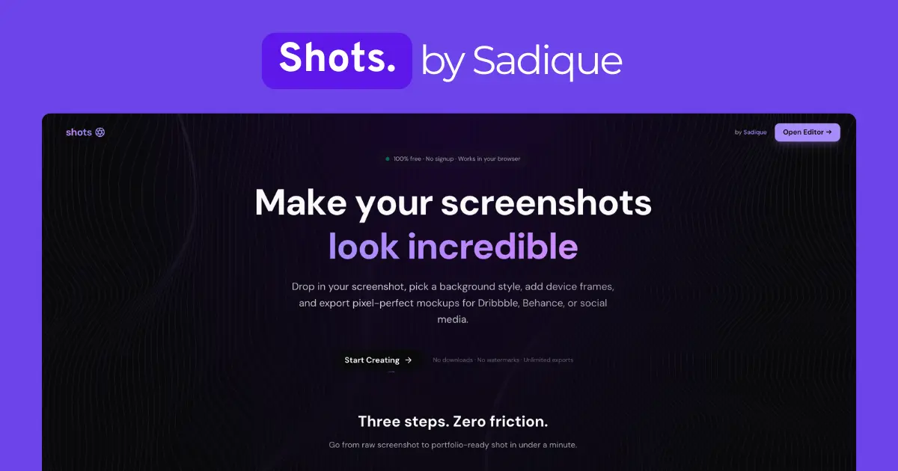

# Shots

**Create stunning Dribbble shots in seconds.**

[shots.sadique.co](https://shots.sadique.co)

Shots is a free, browser-based tool designed to help developers and designers create beautiful, portfolio-ready mockups for Dribbble, Behance, Twitter, and Instagram. Nosignup required, no watermarks, just pure creativity.



## Features

- **🎨 6 Background Styles**: Choose from Gradients, Mesh Gradients, Noise, Patterns, Solids, and more.
- **📱 Device Frames**: Wrap your screenshots in realistic browser windows, phones, tablets, or laptops.
- **📐 Multiple Sizes**: One-click presets for Dribbble, Behance, Twitter, Instagram, and custom dimensions.
- **✨ 3D Perspective**: Add depth with 3D RotateX and RotateY transforms.
- **🚀 100% Free**: No paywalls, no watermarks, unlimited exports.

## About Sadique.co

Shots is part of the **Sadique.co** design ecosystem.

[Sadique.co](https://sadique.co) is a portfolio and digital garden by **Sadique**, focused on building high-quality, open-source tools for the creative community. We believe in crafting software that feels magical to use.

Check out more projects at [sadique.co](https://sadique.co).

## Tech Stack

Built with modern web technologies for performance and experience:

- **Framework**: [Next.js 15](https://nextjs.org/) (App Router)
- **Styling**: [Tailwind CSS v4](https://tailwindcss.com/)
- **UI Components**: [shadcn/ui](https://ui.shadcn.com/)
- **Animations**: [React Bits](https://reactbits.dev/) & [Framer Motion](https://www.framer.com/motion/)
- **Icons**: [Lucide React](https://lucide.dev/)

## Getting Started

To run Shots locally:

1. Clone the repository:
   ```bash
   git clone https://github.com/sadique-xo/shots.git
   ```

2. Install dependencies:
   ```bash
   npm install
   ```

3. Run the development server:
   ```bash
   npm run dev
   ```

4. Open [http://localhost:3000](http://localhost:3000) in your browser.

## License

MIT © [Sadique](https://sadique.co)
